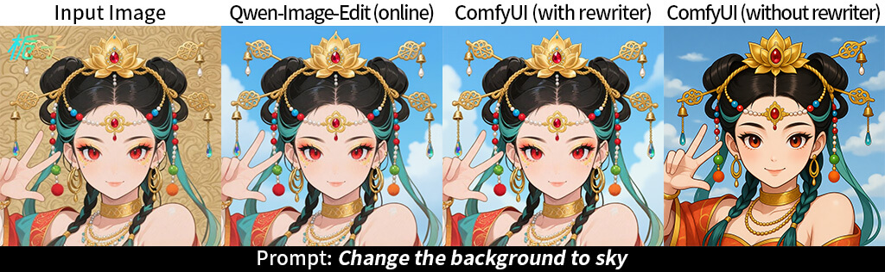
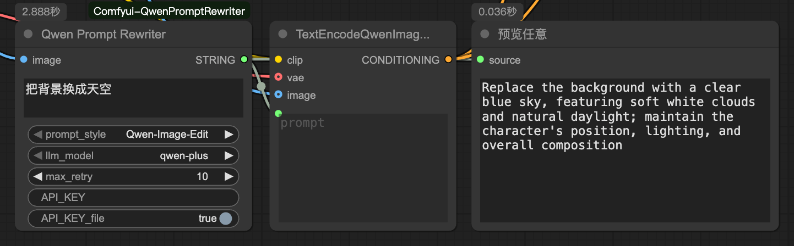

# Comfyui-QwenPromptRewriter
Enhance your prompts using the Qwen LLM to align the behavior and capabilities of the Qwen-Image/Edit online version.  
**[[中文版本](./readme_zh.md)]**

## Preview

## Usage
  

- prompt\_style: `Qwen-Image_Edit` or `Qwen-Image` depending on your model.  
- llm\_model: For `Qwen-Image` only! The `Qwen-Image-Edit` always use `qwen-vl-max-latest` model.    
- max\_retry: Maximum number of retries when an API call fails.  
- API\_KEY: Your [aliyun](https://www.aliyun.com/product/bailian) api key.  
- **API\_KEY\_file: Read your API_KEY from  `api_key.txt` instead of the input box _(Highly Recommended!!!)_**

>  It is recommended to write your API_KEY into the `api_key.txt` file so you can share your workflow safely!
